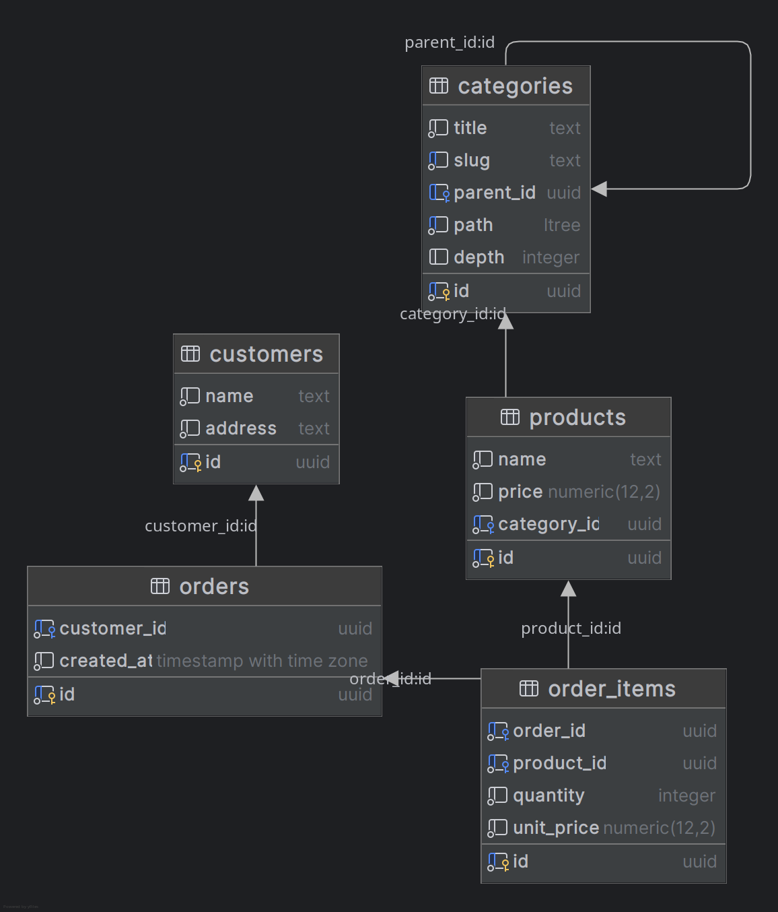

# Иерархическая структура категорий на PostgreSQL с использованием `ltree`

## Выбор СУБД

Для реализации иерархии категорий (категория $\rightarrow$ подкатегория $\rightarrow$ под-подкатегория и т. д.) выбран **PostgreSQL**.  
Причины выбора:
- PostgreSQL обладает встроенным типом данных `ltree`, который удобен для хранения и обработки древовидных структур.
- Есть встроенные хорошо оптимизированные поиск, фильтрация и агрегация по дереву.

---

## Структура базы данных

Основные таблицы:
- **`categories`** — иерархия категорий на основе `ltree`
- **`products`** — товары, принадлежащие категории
- **`customers`** — клиенты (имя клиента считается уникальным;  
  в проде поиск либо по `email`, либо по `id`)
- **`orders`** — заказы клиентов
- **`order_items`** — позиции заказа с количеством и ценой

Для удобства добавлены 2 триггера, позволяющие добавлять по последней подкатегории 
`computers.notebooks` $\rightarrow$ `notebooks` и проще переносить поддеревья.

---
## Связанные таблицы

- `products.category_id` $\rightarrow$ `categories.id` — связь товара с категорией
- `orders.customer_id` $\rightarrow$ `customers.id` — связь заказа с клиентом
- `order_items.order_id` $\rightarrow$ `orders.id` — позиции заказа

